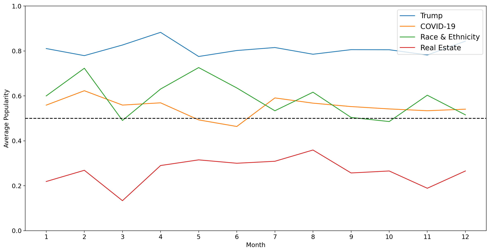

# Capstone Project: Predicting New York Times Article Popularity

## Introduction
The New York Times is one of the most popular news platforms in the world and is visited by a countless number of visitors each day.

The New York Times' focus on subscribers sets them apart in crucial ways from other media organizations. Instead of trying to maximize clicks and sell low-margin advertising, the Times believes in providing high quality journalism and building up reader loyalty through community engagement.

In 2020 alone, there were nearly 5,000,000 comments posted on New York Times articles. That's 13,000 comments per day. While the Times has adopted [machine learning](https://www.nytimes.com/2017/06/13/insider/have-a-comment-leave-a-comment.html) to improve the comment moderation process, a large part of the moderation is still done [by hand](https://www.nytimes.com/2017/09/27/reader-center/comments-moderation.html). In short, the New York Times <b>can't allow comments on every article</b> due to manpower restraints.

This is the problem my project aims to resolve. Having the probability of whether an article is popular or unpopular can help improve the allocation of moderation resources. This will <b>improve comment moderation efficiency</b>, and potentially lead to a larger number of articles being opened for comments.

This could also allow the Times staff to make tweaks to increase article popularity before publishing an article, if they so desire.

This project therefore aims to answer:
- How can the NYT staff improve article popularity?
- Can we accurately predict article popularity? What are the most important predictors?

## Executive Summary

For this project, I scraped over 16,000 articles and 5,000,000 comments from January 2020 - December 2020 using the [nyt-scraper](https://github.com/ietz/nytimes-scraper) package. Some basic data cleaning and pre-processing was also done.

The top-performing model was a XGBoost Classifier which achieved an ROC-AUC score of <b>0.869</b> and an accuracy of <b>0.786</b>. A wide range of feature engineering techniques were used to accomplish this, including sentiment analysis and transformation of categorical features to ordinal features based on overall average popularity. 

Generally, I found that an article's <b>news desk, section, and subsection had a heavy influence </b> on whether it was popular or not. Text-based features like overall word count, headline/abstract length also played a key role. Longer articles tended to be more popular, while having a shorter headline/abstract generally improved popularity. 

The sentiment of the headline/abstract also played affect popularity, where articles with a more negative headline/abstract did better than articles with a neutral headline/abstract. The hour of publication also had an effect on popularity, where articles published late at night tended to draw more comments.

Additionally, certain topics tended to be naturally more popular. Around 80% of articles mentioning Donald Trump each month had more than 90 comments, while only 20% or 30% articles around Real Estate news drew more than 90 comments.

## Recommendations

For articles that our model predicts to be unpopular, the following can be done:
- Re-write ‘neutral’ headlines & abstracts
- Shorten length of headlines & abstracts and include a question mark
- Change publication time to between 10pm and 3am
- Make sure the story is tied to the current socio-political context and use the right keywords
- Use a recommendation system to drive traffic to from popular articles to unpopular articles

As previously mentioned, this model can also be used in tandem with the moderation team's current tools to improve overall moderation effiency.

## Limitations

Of course, just because an article has a low number of comments doesn't necessarily mean it's a low-performing article. The article might not appeal to regular commentators, and might do better on social media.

The NYT has to also uphold a degree of journalistic integrity -- even though using a click-bait headline might get them more comments, it’s in their own interest to remain an impartial and trusted source of news.

Additionally, this model is heavily affected by an article's news desk / section / subsection. More work should be done to ensure that an article's popularity isn't over or under predicted. Other predictors that could be looked into include topic 'freshness', where topics that are new tend to do much better than old topics (unless it's about Donald Trump).

## Final Thoughts

The media industry is changing pretty rapidly -- it isn't enough to put out regular news reports anymore. People are used to getting their news from social media, be it Facebook, Twitter, Instagram or Reddit. That means that they're used to being <b>part of an online community</b>, where anyone can share their views, and publicly agree/disagree with each other. In short, people are increasingly going to be drawn to a news platform that allow them to be part of a community.

There's also been a turn towards reader engagement in the form of interactive articles. Many millennials / Gen Z youth have obtained a pretty high standard of digital literacy. They appreciate graphs and data that personally speaks to them, versus a static page that doesn't allow for any interaction.

As digital advertising changes in the wake of digital privacy laws and changing consumer habits, newspapers and the media industry in general must drastically overhaul their business to stay profitable. This also extends to the field of public relations, which needs to adopt new tools and methodologies to be able to <b>tell stories that people actually want to hear</b>. Being able to predict news popularity will continue to be a key area of interest over the coming years.

## Related Work

In the course of this project, I found a few other datasets that have a similar focus on online news popularity:
- [Mashable 2015 Dataset](https://archive.ics.uci.edu/ml/datasets/online+news+popularity) - contains 39,797 articles and over 61 features. In addition to features such as sentiment polarity, the authors of the dataset used latent dirichlet allocation (LDA) to group articles into five different topics.
- [New York Times Blog Posts 2015 Dataset](https://www.kaggle.com/c/15-071x-the-analytics-edge-competition-spring-2015/overview) - part of a Kaggle competition to predict the popularity of New York Times blog posts. Contains 8420 articles with 9 features.
- [New York Times Comments 2017 / 2018 Dataset](https://www.kaggle.com/aashita/nyt-comments) - exploratory dataset that was mainly used by Kaggle users to analyze comment popularity e.g. what makes a comment popular, or likely to be recommended to other readers by the NYT staff.

## Data Dictionary

The documentation for the NYT articles / comments APIs can be found [here](https://developer.nytimes.com/docs/articlesearch-product/1/overview) and [here](https://developer.nytimes.com/docs/community-api-product/1/overview).